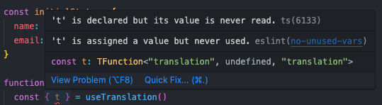

# My preferred eslint settings for personal projects

Currently contains config that can be used for SPA projects, made with Vite or CRA.

## Setting up

Once for a project.

```
npm i -D eslint@8 @publicjorn/eslint-config
```

Add `.eslintrc.cjs` to your project root:

```js
module.exports = {
  root: true,
  extends: '@publicjorn/eslint-config',
}
```

Add a script in `package.json` to lint:

```json
"scripts": {
  "lint": "eslint ./src"
}
```

This will lint everything in the `./src` folder. If you need to lint more, you can adjust accordingly. It is also possible to exclude folders by adding an `.eslintignore` file in the root. It has the same syntax as `.gitignore`.

Make sure to add a step to the pipeline of your project that runs this script.

## Editor integration

For every developer.

### VSCode

- Install the eslint extension: `dbaeumer.vscode-eslint`
- Sometimes it is necessary to reload the editor:  
  Show all commands (cmd+shift+P on mac) -> `Developer: reload window`
- Some things can be auto-fixed by eslint. On mac press: `[option]+[l]`
  - Alternatively, you can configre VSCode to autofix on save:
  - Open VSCode's `settings.json` and add:
    ```json
    "editor.codeActionsOnSave": {
      "source.fixAll.eslint": "explicit"
    },
    ```

## Common issues

If not listed here? [File a new one!](https://github.com/publicJorn/code-consistency/issues)

### Double error

If you get double errors (eslint and ts), this is because of VS Codes built-in linter.  


You can disable it in your (workspace) settings with:

```json
"javascript.validate.enable": false,
```

> Just make sure you don't commit your workspace settings!

## TODO

- Add `"globals": { "React": true, "JSX": true }` to config - used commonly for types in .tsx files
- Test the current TS implementation (overrides) in a Vite TS project
  - It works when adding `plugin:@typescript-eslint/recommended`
- `eslint-plugin-simple-import-sort`
- Make stack specific exports: Expo, NextJS, (and typescript for each as well)

Investigate:

- eslint-plugin-jsx-a11y (this may have significant impact on existing projects)

### About flat config

The following packages do not support flat config, that is why we are not using eslint 9 yet:

- eslint-plugin-import
- eslint-import-resolver-node
- eslint-import-resolver-typescript
- eslint-plugin-react (with react 19, but workaround: https://github.com/facebook/react/issues/28313#issuecomment-2400728604)
